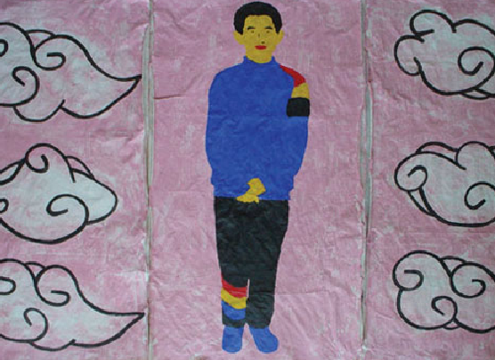

# Greg Kreisman
# 哥龍

## Making marks on various materials
 
- paper
- stone
- metal

## Studying Chinese Calligraphy
## 学习书法
 
- 隶书
- 篆书
- 楷书
- 行书

## Coding in Python
 
- solving problems 
- making apps
- applying code to education

## Education
 
- teaching English
- teacing Chinese
- teaching coding
- teaching art

[About](about.md)
