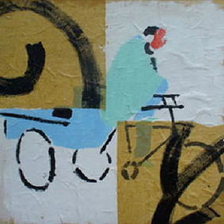
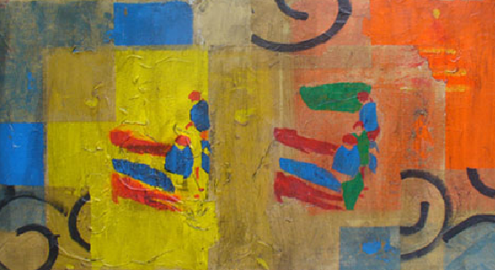

## Greg Kreisman
## 哥龍

is a contemporary artist living in Beijing, China and Sremska Mitrovica, Serbia. 
Raised in the West, he interprets Eastern images and culture through his own multicultural 
eyes and expresses his impressions through an East-West hybrid aesthetic.  He plays with traditional 
Chinese images and elements by staging them among the figures and phenomena of modern Beijing life and his own 
misunderstandings.

### Any mainstream appreaciation of his work is dependant on contact with an extraterrestrial culture.  

See the [Home page](README.md)
